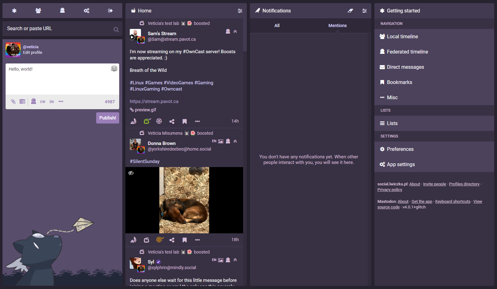

# Witches Town's theme
A purple theme for [Mastodon](https://github.com/tootsuite/mastodon) (updated for version 4.0).

It was originally created by [Alda](https://github.com/Aldarone) for [Witches Town](https://github.com/WitchesTown/) but is now used by various other instances.

(mascot belongs to [Eldritch Café](https://eldritch.cafe) and is not part of this skin)

## Setup
### Instance admins
1. Copy `witches-town` folder into `app/javascript/skins/glitch/` and `witchesAwesome` into `public/`.
2. Recompile static assets: `RAILS_ENV=production bundle exec rails assets:precompile`.
3. Grab a cup o tea, it may take a while.
4. Restart Mastodon (e.g. `systemctl reload mastodon-web`).

### Users
Once the theme have been installed on your instance.
1. Go to the `Preferences` panel.
2. Go to `Flavours > Glitch Edition`.
3. Look for the `Skin` dropdown menu.
4. Select the `Witches Town` skin from it.
5. Save changes with `USE THIS` button.

### Admins (optional)
1. To force skin as your default instance skin go to the `Preferences` panel.
2. Go to `Administration > Server Settings > Appearance`.
3. Look for `Flavour and skin` dropdown menu.
4. Select `witches-town` from it.
5. Hit `SAVE CHANGES` button bellow.

## Licence
Copyright (C) 2017-2018 Alda Marteau-Hardi & other contributors.

This program is free software: you can redistribute it and/or modify it under the terms of the GNU Affero General Public License as published by the Free Software Foundation, either version 3 of the License, or (at your option) any later version.

This program is distributed in the hope that it will be useful, but WITHOUT ANY WARRANTY; without even the implied warranty of MERCHANTABILITY or FITNESS FOR A PARTICULAR PURPOSE. See the GNU Affero General Public License for more details.

You should have received a copy of the GNU Affero General Public License along with this program. If not, see https://www.gnu.org/licenses/.
